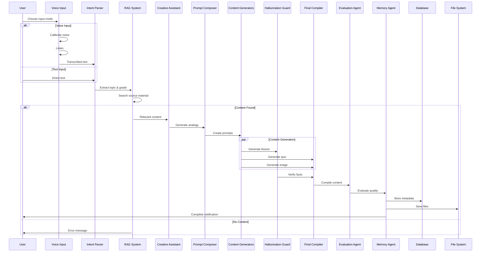
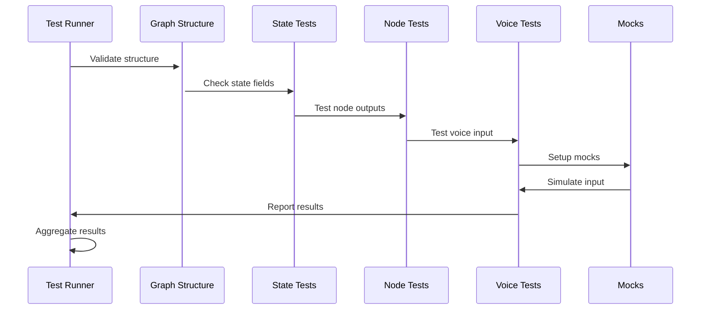
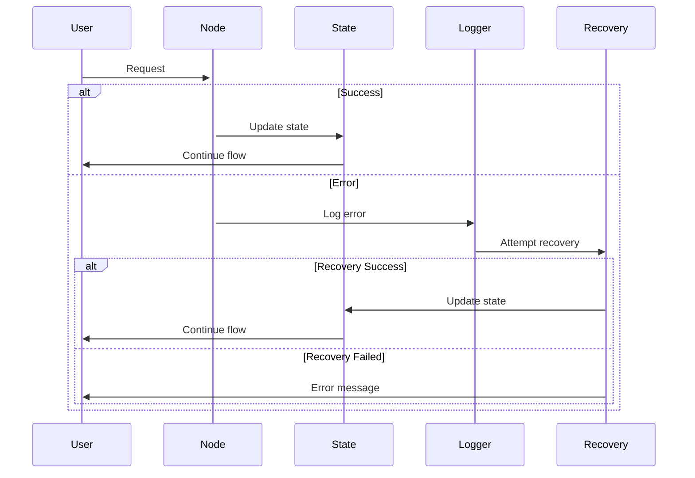

# Sequence Diagrams

## Content Generation Flow

```mermaid
sequenceDiagram
    participant U as User
    participant VI as Voice Input
    participant IP as Intent Parser
    participant RAG as RAG System
    participant CA as Creative Assistant
    participant PC as Prompt Composer
    participant CG as Content Generators
    participant HG as Hallucination Guard
    participant FC as Final Compiler
    participant EA as Evaluation Agent
    participant MA as Memory Agent
    participant DB as Database
    participant FS as File System

    U->>+VI: Choose input mode
    alt Voice Input
        VI->>VI: Calibrate noise
        VI->>VI: Listen
        VI->>IP: Transcribed text
    else Text Input
        U->>IP: Direct text
    end

    IP->>+RAG: Extract topic & grade
    RAG->>RAG: Search source material
    alt Content Found
        RAG->>+CA: Relevant content
        CA->>PC: Generate analogy
        PC->>CG: Create prompts
        par Content Generation
            CG->>HG: Generate lesson
            CG->>FC: Generate quiz
            CG->>FC: Generate image
        end
        HG->>FC: Verify facts
        FC->>EA: Compile content
        EA->>MA: Evaluate quality
        MA->>DB: Store metadata
        MA->>FS: Save files
        MA->>U: Complete notification
    else No Content
        RAG->>U: Error message
    end
```

## Testing Flow

```mermaid
sequenceDiagram
    participant T as Test Runner
    participant GS as Graph Structure
    participant ST as State Tests
    participant NT as Node Tests
    participant VT as Voice Tests
    participant M as Mocks

    T->>+GS: Validate structure
    GS->>ST: Check state fields
    ST->>NT: Test node outputs
    NT->>VT: Test voice input
    VT->>M: Setup mocks
    M->>VT: Simulate input
    VT->>T: Report results
    T->>T: Aggregate results
```

## Error Handling Flow

```mermaid
sequenceDiagram
    participant U as User
    participant N as Node
    participant S as State
    participant L as Logger
    participant R as Recovery

    U->>+N: Request
    alt Success
        N->>S: Update state
        S->>U: Continue flow
    else Error
        N->>L: Log error
        L->>R: Attempt recovery
        alt Recovery Success
            R->>S: Update state
            S->>U: Continue flow
        else Recovery Failed
            R->>U: Error message
        end
    end
``` 